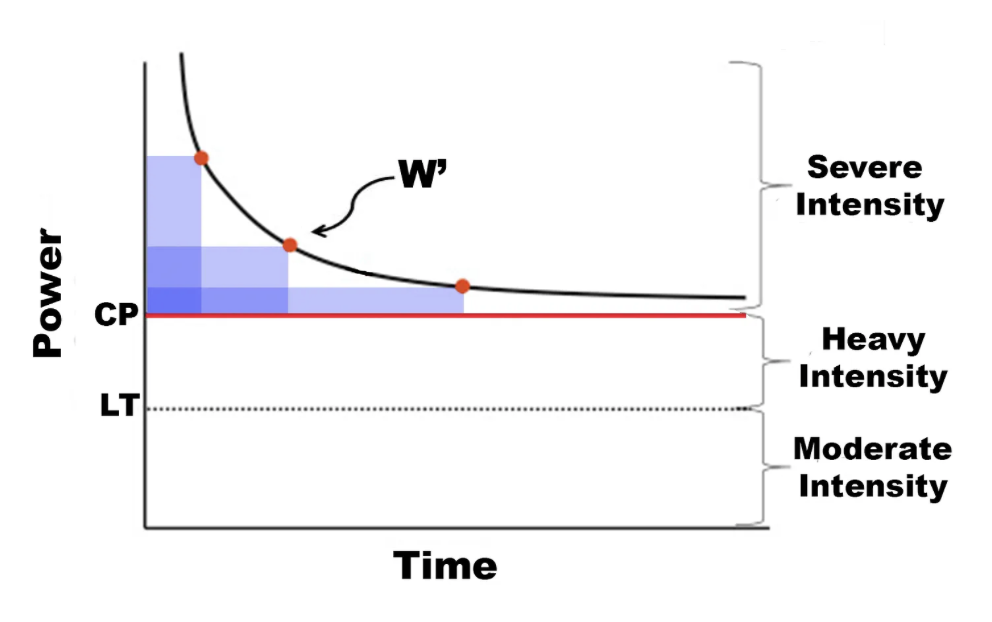

# Project Background 
👽 


# What Is Critical Power?
Critical power is mathematically defined as the power-asymptote of the hyperbolic relationship between power output and time to exhaustion. In essence, critical power describes the duration that an individual can sustain a fixed power output in the severe exercise intensity domain, and physiologically critical power represents the boundary between steady-state and non-steady-state exercise]. As a result, critical power may provide a more meaningful fitness index over more well-known performance metrics such as VO2max or functional threshold power. The hyperbolic equation which describes the relationship between power output and exercise tolerance within the severe exercise intensity domain is as follows:

```
Time to Exhaustion = W’ / Power - Critical Power
```

This equation creates a two-parameter model where critical power represents the asymptote for power, and the W’ represents a finite amount of work that can be done above critical power, as demonstrated in the image below:



Taken together, these two parameters can be used to predict how long an individual can exercise at any intensity above their critical power output. Interestingly, the critical power model appears to apply across kingdoms, phylums,  and classes of animal life as well as different forms of exercise, and individual muscles for a given athlete. These observations suggest a highly conserved and organized physiological process, and perhaps a unifying principle of bioenergetics.

# How Is Critical Power Calculated?
There are currently two validated methods for determining critical power and the fixed amount of work that can be done above critical power, termed W’. Traditionally critical power and W’ were calculated after having an individual perform three to seven all-out work bouts where they hold a fixed power-output until failure. These test results are then plotted on a chart where the x,y variables represent time to failure and power for each trial. Critical power is then determined as the slope of the work-time relationship, whereas W’ is determined from the y-intercept. More recently, though, investigators have introduced a 3-minute all-out exercise test, known as the 3MT, that has enabled the determination of critical power and W’ from a single exercise bout. The idea behind the 3-minute all-out test is that when a subject exerts themselves fully and expends W’ wholly, their finishing power output equals their critical power. 

In the code block below, I'll show you how to calcualte critical power using an athlete's historic training data from multiple time to exhaustion trials:

```python
# import libraries 
import numpy as np
import pandas as pd
from scipy.optimize import curve_fit
import matplotlib.pyplot as plt

# Create data frame to store power - duration data
data = pd.DataFrame({
    'Power (watts)': [278, 349, 455, 435,  725], 
    'Duration (sec)': [3533, 1790, 600, 300, 120]})

# define function for power duration curve
def power_duration_curve(t, CP, W_prime):
  power = CP + W_prime / t
  return power

# extract power and duration data from data frame 
power = data['Power (watts)'].values
duration = data['Duration (sec)'].values

# perform non-linear regression to fit the power - duration model 
popt, pcov = curve_fit(power_duration_curve, duration, power)
CP, W_prime = popt

# print the estimated CP and W' values
print(f"Estimated Critical Power (CP): {CP:.1f} Watts")
print(f"Estimated W': {W_prime:.1f} Joules")
```
Which, produces the following output:
- Estimated Critical Power (CP): 306.8 Watts
- Estimated W': 50664.4 Joules

After calculating critical power with the code block above, we can plot the athlete's power-duration curve using the following code:

```python
plt.scatter(duration, power, label='Athlete data', color='blue')
t_fit = np.linspace(min(duration), max(duration), 100)
P_fit = power_duration_curve(t_fit, CP, W_prime)
plt.plot(t_fit, P_fit, label='Fitted Model', color='red')
plt.xlabel('Duration (seconds)')
plt.ylabel('Power (watts)')
plt.legend()
plt.show()
```
Which produces the following chart:


Now, as previously mentioned, the following formula can be used to calculate an athlete's time to exhaustion when exercising at a fixed power output when both their critical power adn W' are known: ```Time to Exhaustion = W’ / Power - Critical Power``` For example, if an athlete's critical power is 306 watts, their W' is 50664 joules we can use the following formula to see how long they can sustain a fixed power output of 500 watts: ```Time to exhaustion = 50664 / 500 - 306 = 261 seconds```

However, a major limitation of the formula above is that it's only applicable during fixed power output work bouts and does not account for scenarios where poewr output varies, such as during interval training or racing where power can fluctuate by a large degree moment to moment. In these scenarios, it's necessary to go beyond the traditional critical power model. 

# Beyong Critical Power: The W' Balance Model

Whereas teh traditional critical power model allows you to predicting the time to exhaustion when power is held constant, the W' balance model allows us to account for varying power outputs and dynamic work/rest scenarios. This model tracks the depletion and recovery of W' over time, providing a more accurate prediction of an athlete's fatigue status during activities with changing intensities. For example, when an athlete's power output is greater than their critical power, W' is depleted (the rate of depletion is proportional to how much power exceeds critical power). Alternativley, when an athlete's power ouput is below their critical power, W' is restored and the rate of recovery is a function of the difference between their critical power and current power output and their recovery constant, Tau. 

Thus, the W' balance model continuously updates the remaining W' based on the power output and CP over time. In the code block below I'll show you how to apply the W' balance model to a real athlete's power data, recorded during a ramp incremental exercise test (note, this athlete's estimated critical power is ~306 watts and their estimated W' is ~50664 joules, as calculated in the last section):

```python
# load athlete's power data
filename = 'power2.csv'
names = ['time', 'power']
workout_data = pd.read_csv(filename, names=names)

# drop empty rows (the default file above is structured with every other row being empty)
workout_data = workout_data.dropna()
workout_data.reset_index(drop=True, inplace=True)

# initialize the W' balance model
W_bal = np.zeros(len(workout_data))
W_bal[0] = W_prime
tau_recovery =250  # adjust time constant based on experimental data

# Function to update W' balance
for i in range(1, len(workout_data)):
    dt = workout_data['time'].iloc[i] - workout_data['time'].iloc[i - 1]
    power = workout_data['power'].iloc[i]

    if power > CP: # depletion of W'
        W_bal[i] = W_bal[i - 1] - (power - CP) * dt
    else: # recovery of W'
        W_bal[i] = W_bal[i - 1] + (W_prime - W_bal[i - 1]) * (1 - np.exp(-dt / tau_recovery))

    # ensure W' balance does not go below 0 or above W'
    W_bal[i] = max(0, min(W_prime, W_bal[i]))

# add W' balance to workout data
workout_data['W_bal'] = W_bal
```
We can then plot the athlete's time series power data with their modeling W' balance, as demonstrated below:

```python
# create subplots
fig, ax1 = plt.subplots(figsize=(10, 6))

# plot W' balance on the left y-axis
ax1.plot(workout_data['time'], workout_data['W_bal'], label="W' Balance", color='red')
ax1.set_xlabel('Time (seconds)')
ax1.set_ylabel("W' Balance (Joules)", color='red')
ax1.tick_params(axis='y', labelcolor='red')

# create a second y-axis to plot power 
ax2 = ax1.twinx()
ax2.plot(workout_data['time'], workout_data['power'], label='Power Output', color='blue')
ax2.set_ylabel('Power Output (Watts)', color='blue')
ax2.tick_params(axis='y', labelcolor='blue')

# combine legends from both y-axes
lines, labels = ax1.get_legend_handles_labels()
lines2, labels2 = ax2.get_legend_handles_labels()
ax1.legend(lines + lines2, labels + labels2, loc='best')

plt.show()
```
Which produces the following chart:


As you can see, the  W' balance model is a powerful tool for evaluating an athlete's pacing strategy and energy utilization during a race or a training session. By plotting the power output and W' balance over time, we can gain insights into how effectively the athlete managed their energy reserves. For example, when W' balance hits zero at the end of a race or test, it indicates that the athlete has fully utilized their available W' and paced the effort perfectly. This is often a sign of optimal pacing strategy. Alternativley, 
if the athlete finishes the race with a positive W' balance, it suggests that they had some unused energy reserve. This might indicate conservative pacing, where the athlete could have potentially exerted more power and achieved a faster time.

# Critical Metabolic Rate and M' Balance

Critical Metabolic Rate (CMR) and Critical Power (CP) are concepts used to model an athlete's performance and endurance capabilities. While they share some similarities, they are applied to different physiological parameters and provide insights into different aspects of athletic performance. For example, critical metabolic rate (CMR) is applied to muscle oxygenation rates of change (ΔSmO2), and CMR represents the highest sustainable rate of muscle oxygenation change (%/s) an athlete can maintain over a prolonged period without leading to an unsustainable drop in muscle oxygenation levels.

In the code block below, I'll show you how to calculate an athlete's critical metabolic rate using historic training data from multiple time to exhaustion trials:
```python
# import libraries
import numpy as np
import pandas as pd
from scipy.optimize import curve_fit
import matplotlib.pyplot as plt

# create data frame to store deoxy - duration data
data = pd.DataFrame({
    'De-oxy rate': [-0.019, -0.035, -0.048, -0.068, -0.22], 
    'Duration': [7200, 4800, 3600, 2400, 1200]})

# define function for critical metabolic rate model
def critical_metabolic_rate(t, CMR, M_prime):
    return CMR + M_prime / t

# extract deoxy rate and duration data from data frame
deoxy_rate = data['De-oxy rate'].values
duration = data['Duration'].values

# perform non-linear regression to fit the deoxy rate - duration model 
popt, pcov = curve_fit(critical_metabolic_rate, duration, deoxy_rate)
CMR, M_prime = popt

# print the estimated parameters
print(f"Estimated Critical Metabolic Rate (CMR): {CMR:.5f} %/s")
print(f"Estimated M': {M_prime:.5f}")
```
Which produces the following output:
- Estimated Critical Metabolic Rate (CMR): 0.03111 %/s
- Estimated M': -290.96203

Ordinarily critical metabolic rate is negative and approximates zero, but in some cases we may see a positive value. Additionally, M' is negative since it represents the area between the deoxy-duration curve and the y-intercept (i.e, critical metabolic rate), as demonstrated in the image below. However, we will invert the sign on M' when modeling M' balance as you'll see in the next code block. 

[IMAGE]

Now, we'll use our calculated critical metabolic rate and M' as inputs for our M' balance model, which is an adaptation of the W' balance model used in the context of critical power. The M' balance model applies the same principles to muscle oxygenation data, focusing on the rate of change of muscle oxygen saturation (ΔSmO2) instead of power output, as demonstrated in the code block below:
```python
filename = 'O2.csv'
names = ['time', 'SmO2', 'SmO2_accel', 'SmO2_jerk', 'acceleration','jerk']
workout_data = pd.read_csv(filename, names=names)

# Define a rolling window size
window_size = 10

# calculate rolling metrics
workout_data['SmO2_rolling_mean'] = workout_data['SmO2'].rolling(window=window_size).mean()
workout_data['SmO2_accel_rolling_mean'] = workout_data['SmO2_accel'].rolling(window=window_size).mean()
workout_data = workout_data.fillna(method='bfill')

CMR = CMR
M_prime = M_prime * - 1 # Invert sign

# initialize M' balance model
M_bal = np.zeros(len(workout_data))
M_bal[0] = M_prime
tau_recovery = 300  # Example recovery time constant, adjust as needed

# update M' balance
for i in range(1, len(workout_data)):
    dt = workout_data['time'].iloc[i] - workout_data['time'].iloc[i - 1]
    d_rate = workout_data['SmO2_accel_rolling_mean'].iloc[i]
    if d_rate < CMR: # Depletion of M'
        M_bal[i] = M_bal[i - 1] - (CMR - d_rate) * dt
    else: # restoration of M'
        M_bal[i] = M_bal[i - 1] + (M_prime - M_bal[i - 1]) * (1 - np.exp(-dt / tau_recovery))

    # Ensure M' balance does not go below 0 or above M'

# add M' balance to workout data
workout_data['M_bal'] = M_bal

# create subplots
fig, ax1 = plt.subplots(figsize=(10, 6))

# plot M' Balance on the left y-axis
ax1.plot(workout_data['time'], workout_data['M_bal'], label="M' Balance", color='red')
ax1.set_xlabel('Time (seconds)')
ax1.set_ylabel("M' Balance", color='red')
ax1.tick_params(axis='y', labelcolor='red')

# create a second y-axis to plot SmO2
ax2 = ax1.twinx()
ax2.plot(workout_data['time'], workout_data['SmO2'], label='Δ SmO2 Rate', color='blue')
ax2.set_ylabel('Muscle oxygenation (%)', color='blue')
ax2.tick_params(axis='y', labelcolor='blue')

# add legends and show plot
lines, labels = ax1.get_legend_handles_labels()
lines2, labels2 = ax2.get_legend_handles_labels()
ax1.legend(lines + lines2, labels + labels2, loc='best')
plt.show()
```
Which produces the following output:


